<div align="center">

# 🧬 AI QA Genesis

### *Next-Generation Autonomous Testing Intelligence*

[](https://www.python.org/)
[](https://fastapi.tiangolo.com/)
[](https://streamlit.io/)
[](LICENSE)
[](https://autonomous-qa-agent-isn6.onrender.com)

**Transform documentation into executable test cases and Selenium scripts using the power of AI**

[🚀 Live Demo](https://pranjal-s-autonomous-agent.streamlit.app/) • [📚 Documentation](DOCUMENTATION.md) • [🔧 Deployment Guide](DEPLOYMENT.md)

</div>

---

## 🎯 What is AI QA Genesis?

AI QA Genesis is an **intelligent autonomous testing agent** that revolutionizes the QA workflow by automatically generating comprehensive test cases and executable Selenium automation scripts from your project documentation. Powered by Google Gemini AI and Retrieval Augmented Generation (RAG), it understands your product specifications and creates production-ready test suites in seconds.

### ✨ Key Features

🎯 **Intelligent Document Processing**
- Supports multiple formats: Markdown, TXT, JSON, HTML
- Semantic chunking for optimal context retrieval
- Vector-based similarity search using ChromaDB

🧠 **AI-Powered Test Generation**
- Context-aware test case creation
- Grounded in your actual documentation
- Structured JSON output with full traceability

📜 **Automated Script Creation**
- Production-ready Selenium Python scripts
- Includes assertions, waits, and error handling
- Ready to integrate into your CI/CD pipeline

🎨 **Modern Premium UI**
- Beautiful Streamlit interface
- Dark/Light mode toggle
- Interactive workflow visualization
- Real-time processing feedback

☁️ **Cloud-Ready Architecture**
- Deployed on Render.com (Backend) + Streamlit Cloud (Frontend)
- In-memory vector storage for zero-config deployment
- Environment-based configuration

---

## 🏗️ Architecture

### System Architecture

```mermaid
graph TB
    subgraph "Frontend Layer"
        UI[🎨 Streamlit UI<br/>Interactive Dashboard]
    end
    
    subgraph "API Layer"
        API[⚡ FastAPI Backend<br/>REST Endpoints]
    end
    
    subgraph "Service Layer"
        ING[📚 Ingestion Service<br/>Document Processing]
        RAG[🔍 RAG Service<br/>Context Retrieval]
        LLM[🤖 LLM Service<br/>AI Generation]
    end
    
    subgraph "Data Layer"
        VDB[(💾 ChromaDB<br/>Vector Store)]
    end
    
    subgraph "External Services"
        GEMINI[✨ Google Gemini API<br/>Embeddings + Generation]
    end
    
    UI -->|HTTP| API
    API --> ING
    API --> RAG
    API --> LLM
    
    ING --> VDB
    RAG --> VDB
    
    ING -.->|Embeddings| GEMINI
    LLM -.->|Generation| GEMINI
    
    style UI fill:#667eea,stroke:#764ba2,color:#fff
    style API fill:#f093fb,stroke:#f5576c,color:#fff
    style VDB fill:#4facfe,stroke:#00f2fe,color:#fff
    style GEMINI fill:#43e97b,stroke:#38f9d7,color:#fff
```



### Data Flow Pipeline


---

## 🚀 Quick Start

### Prerequisites

- Python 3.11+
- Google Gemini API Key ([Get it here](https://makersuite.google.com/app/apikey))
- Git

### Local Installation

1. **Clone the Repository**
```bash
git clone https://github.com/pranjalkhare2004/Autonomous-QA-Agent.git
cd Autonomous-QA-Agent
```

2. **Install Dependencies**
```bash
pip install -r requirements.txt
```

3. **Set Environment Variables**
```bash
# Create .env file
cp .env.example .env

# Add your API key
echo "GOOGLE_API_KEY=your_api_key_here" > .env
```

4. **Start the Backend**
```bash
uvicorn app.main:app --reload
```
Backend will run at `http://localhost:8000`

5. **Start the Frontend** (New Terminal)
```bash
streamlit run app/ui.py
```
UI will open at `http://localhost:8501`

---

## 💡 Usage Guide

### Step 1: Ingest Knowledge Base


1. Navigate to **📂 Knowledge Ingestion** tab
2. Upload your documents:
   - Product specifications (`.md`)
   - UI/UX guidelines (`.txt`)
   - Target HTML pages (`.html`)
   - Business rules (`.json`)
3. Click **⚡ INGEST & VECTORIZE**
4. Wait for processing confirmation

### Step 2: Generate Test Cases


1. Navigate to **🧪 Test Generation** tab
2. Enter your testing objective:
   ```
   Generate comprehensive test cases for discount code validation
   ```
3. Click **✨ GENERATE TESTS**
4. Review AI-generated test cases with full context traceability

**Sample Output:**
```json
{
  "Test_ID": "TC_001",
  "Feature": "Discount Code Validation",
  "Test_Scenario": "Apply valid discount code SAVE15 at checkout",
  "Expected_Result": "15% discount applied to cart total",
  "Grounded_In": "product_specs.md"
}
```

### Step 3: Generate Selenium Scripts


1. Navigate to **📜 Script Automation** tab
2. Select a test case from previous step
3. Upload target HTML file
4. Click **💻 GENERATE PYTHON CODE**
5. Download ready-to-execute Selenium script

**Generated Script Features:**
- ✅ WebDriver setup (Chrome)
- ✅ Element locators (CSS/XPATH)
- ✅ Explicit waits
- ✅ Assertions
- ✅ Error handling
- ✅ Cleanup code

---

## 📊 Project Structure

```
Autonomous-QA-Agent/
│
├── app/
│   ├── main.py                 # FastAPI backend entry point
│   ├── ui.py                   # Streamlit frontend
│   │
│   ├── services/               # Business logic
│   │   ├── ingestion.py        # Document processing & vectorization
│   │   ├── rag_service.py      # Context retrieval
│   │   └── llm_service.py      # Gemini AI interactions
│   │
│   └── utils/
│       └── parsers.py          # File format parsers
│
├── .env.example                # Environment template
├── requirements.txt            # Python dependencies
├── Procfile                    # Render deployment config
├── runtime.txt                 # Python version
│
├── DOCUMENTATION.md            # Complete technical docs
├── DEPLOYMENT.md               # Deployment guide
└── README.md                   # This file
```

---

## ☁️ Cloud Deployment

### Live Production URLs

- **🌐 Frontend**: https://pranjal-s-autonomous-agent.streamlit.app/
- **⚡ Backend**: https://autonomous-qa-agent-isn6.onrender.com

### Deploy Your Own

#### Backend (Render.com)

1. **Sign up at [render.com](https://render.com)**
2. **Create New Web Service** → Connect GitHub repo
3. **Configure**:
   - **Build Command**: `pip install -r requirements.txt`
   - **Start Command**: `uvicorn app.main:app --host 0.0.0.0 --port $PORT`
   - **Environment**: Add `GOOGLE_API_KEY`
4. **Deploy** (takes ~5 minutes)

#### Frontend (Streamlit Cloud)

1. **Sign up at [streamlit.io/cloud](https://streamlit.io/cloud)**
2. **New App** → Select your repo
3. **Configure**:
   - **Main file**: `app/ui.py`
   - **Python version**: `3.11`
   - **Secrets**: Add `GOOGLE_API_KEY` and `BACKEND_URL`
4. **Deploy** (takes ~3 minutes)

📖 **Full deployment guide**: [DEPLOYMENT.md](DEPLOYMENT.md)

---

## 🛠️ Technology Stack

<table>
<tr>
<td width="50%">

### Backend
- **Framework**: FastAPI
- **Server**: Uvicorn (ASGI)
- **Vector DB**: ChromaDB (In-memory)
- **AI Framework**: LangChain
- **LLM**: Google Gemini API

</td>
<td width="50%">

### Frontend
- **UI Framework**: Streamlit
- **HTTP Client**: Requests
- **Visualization**: Graphviz
- **Styling**: Custom CSS

</td>
</tr>
<tr>
<td>

### AI/ML
- **Embeddings**: text-embedding-004
- **Generation**: gemini-flash-latest
- **Vector Search**: Semantic similarity
- **Context Window**: 1000 chars/chunk

</td>
<td>

### DevOps
- **Deployment**: Render + Streamlit Cloud
- **CI/CD**: GitHub Actions (optional)
- **Monitoring**: Built-in logs
- **Storage**: In-memory (cloud-friendly)

</td>
</tr>
</table>

---

## 🎨 Features Showcase

### 🌙 Dark/Light Mode Toggle
Switch between premium dark (cyberpunk) and light themes with a single click.

### 📊 Interactive Pipeline Diagram
Visualize the complete data flow from document ingestion to script generation.

### 🎯 Real-Time Processing
Watch your documents being processed with live progress indicators and balloons on success!

### 📥 One-Click Download
Generated Selenium scripts are instantly downloadable with proper naming conventions.

---

## 🔐 Security & Best Practices

- ✅ **API Keys**: Never committed to Git (`.env` in `.gitignore`)
- ✅ **Environment Variables**: Centralized configuration
- ✅ **Input Validation**: Pydantic models enforce strict schemas
- ✅ **Error Handling**: Graceful failures with user-friendly messages
- ✅ **CORS**: Configured for specific origins
- ✅ **Rate Limiting**: Consider adding for production (slowapi)

---

## 📈 Performance & Scalability

| Metric | Value |
|--------|-------|
| **Document Processing** | ~2-3s per file |
| **Test Case Generation** | ~5-8s for 3-5 cases |
| **Script Generation** | ~8-12s per script |
| **Concurrent Users** | Supports 10+ (free tier) |
| **Cold Start** | ~30s (Render free tier) |
| **Vector Search** | Sub-second retrieval |

---

## 🤝 Contributing

Contributions are welcome! Here's how you can help:

1. 🍴 Fork the repository
2. 🌿 Create a feature branch (`git checkout -b feature/amazing-feature`)
3. 💾 Commit changes (`git commit -m 'Add amazing feature'`)
4. 📤 Push to branch (`git push origin feature/amazing-feature`)
5. 🎉 Open a Pull Request

**Areas for Contribution:**
- 🧪 Additional test case templates
- 🔧 New file format parsers
- 🎨 UI/UX improvements
- 📚 Documentation enhancements
- 🐛 Bug fixes

---

## 🗺️ Roadmap

- [x] **Phase 1**: Core RAG pipeline
- [x] **Phase 2**: Test case generation
- [x] **Phase 3**: Selenium script generation
- [x] **Phase 4**: Cloud deployment
- [x] **Phase 5**: Premium UI with dark mode
- [ ] **Phase 6**: Persistent vector storage (cloud DB)
- [ ] **Phase 7**: Multi-user authentication
- [ ] **Phase 8**: Test execution engine
- [ ] **Phase 9**: Results dashboard
- [ ] **Phase 10**: CI/CD integration

---

## 📄 License

This project is licensed under the **MIT License** - see the [LICENSE](LICENSE) file for details.

---

## 👨‍💻 Author

**Pranjal Khare**

[](https://github.com/pranjalkhare2004)
[](https://linkedin.com/in/pranjalkhare)

---

## 🙏 Acknowledgments

- **Google Gemini AI** for powerful LLM capabilities
- **LangChain** for RAG framework
- **Streamlit** for amazing UI framework
- **FastAPI** for modern API development
- **ChromaDB** for vector storage
- **Render & Streamlit Cloud** for free hosting

---

## 📞 Support

Having issues? Here are your options:

1. 📖 Check [DOCUMENTATION.md](DOCUMENTATION.md) for detailed technical docs
2. 🚀 See [DEPLOYMENT.md](DEPLOYMENT.md) for deployment troubleshooting
3. 🐛 Open an [issue](https://github.com/pranjalkhare2004/Autonomous-QA-Agent/issues)
4. 💬 Start a [discussion](https://github.com/pranjalkhare2004/Autonomous-QA-Agent/discussions)

---

<div align="center">

### ⭐ Star this repo if you find it useful!

**Made with ❤️ by Pranjal Khare**

*Transforming QA workflows, one test at a time* 🚀

</div>
